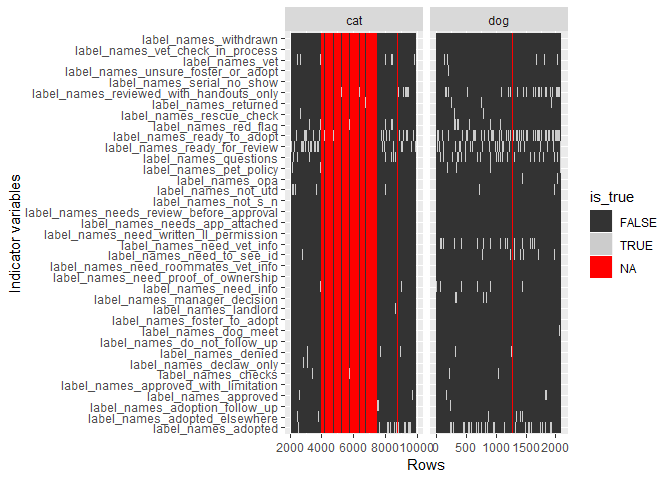
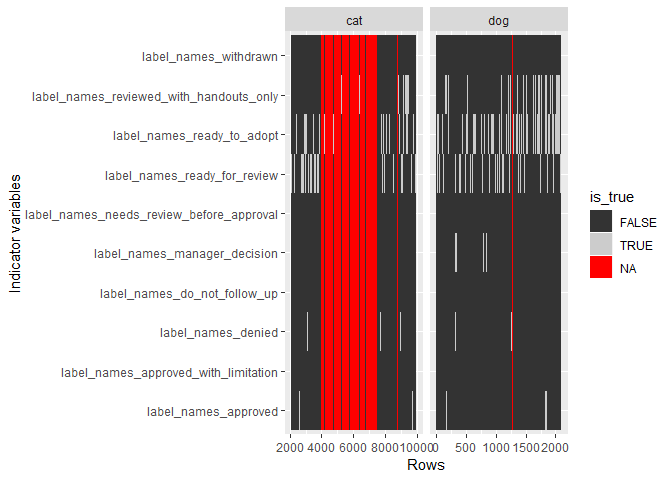
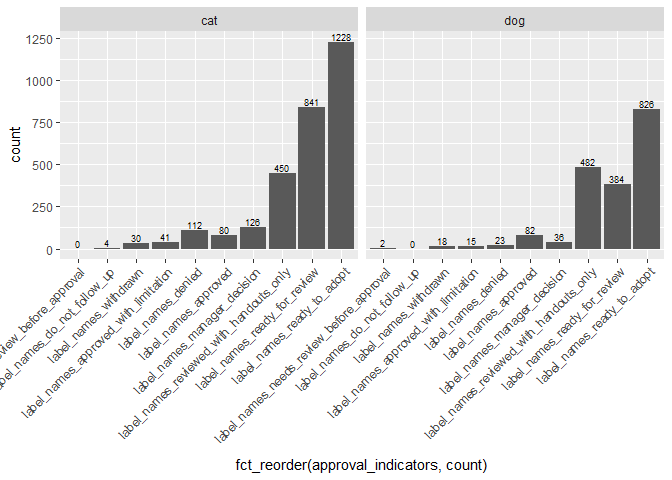
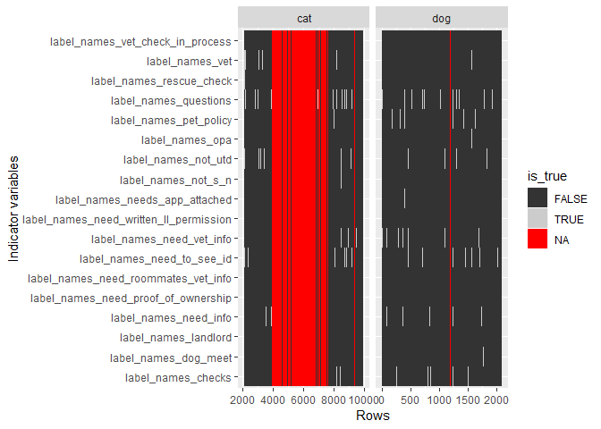
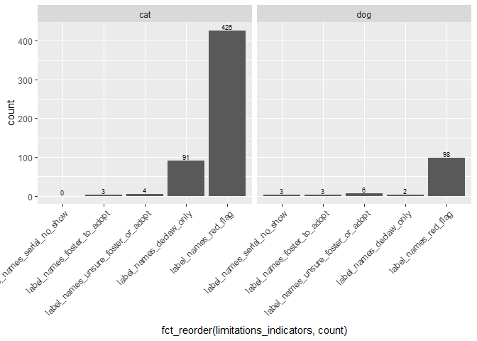
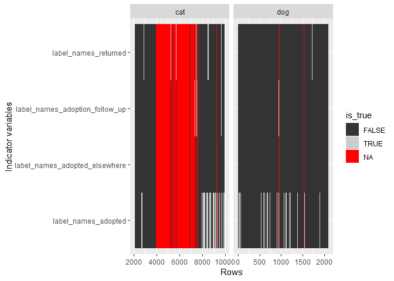

Label names
================
Amy Goodwin Davies

-   [Summary of all label names](#summary-of-all-label-names)
    -   [Label names relating to application approval status](#label-names-relating-to-application-approval-status)
    -   [Label names relating to issues with the application](#label-names-relating-to-issues-with-the-application)
    -   [Label names relating to limitations of the application](#label-names-relating-to-limitations-of-the-application)
    -   [Label names relating to adoption status](#label-names-relating-to-adoption-status)

``` r
library(tidyverse)
library(lubridate)
```

``` r
source("Analyses/2_Applicants/helper_functions.R")
```

Summary of all label names
==========================

``` r
cat_cards <- read_csv("Data/cat_cards.csv")
dog_cards <- read_csv("Data/dog_cards.csv")
cards <- rbind(dog_cards, cat_cards)
head(cards)
```

    ## # A tibble: 6 x 6
    ##   id      dateLastActivity dueComplete due        animal_type label_names 
    ##   <chr>   <date>           <lgl>       <date>     <chr>       <chr>       
    ## 1 5a6b7b~ 2018-01-31       FALSE       2018-01-26 dog         ready for r~
    ## 2 5a6d20~ 2018-01-31       TRUE        2018-01-27 dog         ready for r~
    ## 3 5a6a4f~ 2018-01-31       TRUE        2018-01-25 dog         not utd     
    ## 4 5a6533~ 2018-01-31       TRUE        2018-01-21 dog         not utd     
    ## 5 5a673b~ 2018-01-30       FALSE       NA         dog         need info   
    ## 6 5a6d23~ 2018-01-30       FALSE       NA         dog         need vet in~

``` r
length(unique(cards$id)) == nrow(cards)
```

    ## [1] TRUE

``` r
str(cards$label_names)
```

    ##  chr [1:9989] "ready for review" "ready for review" "not utd" ...

``` r
length(unique(cards$label_names))
```

    ## [1] 819

``` r
label_names_tidy <- tidy_elements(cards, "label_names")
cards <- label_names_tidy$output_df
label_names_elements <- label_names_tidy$elements
label_names_new_colnames <- label_names_tidy$new_colnames
label_names_elements_summary <- label_names_tidy$elements_summary
ggplot(label_names_elements_summary, aes(x = fct_reorder(label_names, count), y = count)) +
  geom_bar(stat = "identity") +
  geom_text(aes(label = count), vjust = -0.25, position = "identity", size = 2.5) +
  theme(axis.text.x = element_text(angle = 45, hjust = 1)) +
  guides(fill=FALSE)
```


``` r
label_names_new_colnames
```

    ##  [1] "label_names_ready_for_review"            
    ##  [2] "label_names_not_utd"                     
    ##  [3] "label_names_need_info"                   
    ##  [4] "label_names_need_vet_info"               
    ##  [5] "label_names_questions"                   
    ##  [6] "label_names_ready_to_adopt"              
    ##  [7] "label_names_withdrawn"                   
    ##  [8] "label_names_adopted"                     
    ##  [9] "label_names_returned"                    
    ## [10] "label_names_pet_policy"                  
    ## [11] "label_names_adopted_elsewhere"           
    ## [12] "label_names_need_to_see_id"              
    ## [13] "label_names_denied"                      
    ## [14] "label_names_red_flag"                    
    ## [15] "label_names_dog_meet"                    
    ## [16] "label_names_manager_decision"            
    ## [17] "label_names_rescue_check"                
    ## [18] "label_names_approved_with_limitation"    
    ## [19] "label_names_approved"                    
    ## [20] "label_names_reviewed_with_handouts_only" 
    ## [21] "label_names_vet"                         
    ## [22] "label_names_opa"                         
    ## [23] "label_names_checks"                      
    ## [24] "label_names_unsure_foster_or_adopt"      
    ## [25] "label_names_adoption_follow_up"          
    ## [26] "label_names_needs_app_attached"          
    ## [27] "label_names_declaw_only"                 
    ## [28] "label_names_serial_no_show"              
    ## [29] "label_names_foster_to_adopt"             
    ## [30] "label_names_needs_review_before_approval"
    ## [31] "label_names_do_not_follow_up"            
    ## [32] "label_names_need_written_ll_permission"  
    ## [33] "label_names_need_proof_of_ownership"     
    ## [34] "label_names_not_s_n"                     
    ## [35] "label_names_landlord"                    
    ## [36] "label_names_vet_check_in_process"        
    ## [37] "label_names_need_roommates_vet_info"

``` r
all(grepl("ready for review", cards$label_names) == cards$label_names_ready_for_review, na.rm = TRUE)
```

    ## [1] TRUE

``` r
all(grepl("denied", cards$label_names) == cards$label_names_denied, na.rm = TRUE)
```

    ## [1] TRUE

``` r
all(grepl("vet check in process", cards$label_names) == cards$label_names_vet_check_in_process, na.rm = TRUE)
```

    ## [1] TRUE

``` r
all(grepl("vet", cards$label_names) == cards$label_names_vet, na.rm = TRUE) # should be false as "vet" is a substring of other label names
```

    ## [1] FALSE

``` r
# adapted from: https://www.kaggle.com/ranliu/r-ladies-philly-intro-to-machine-learning-meetup
cards$animal_type <- as.factor(cards$animal_type)

true_by_column <- cards %>% 
    select(label_names_new_colnames, animal_type) %>%
    as_data_frame() %>%
    mutate(row_number = 1:nrow(.)) %>%
    gather(key = variable, value = is_true, -row_number, -animal_type) 

ggplot(true_by_column, aes(y = variable, x = row_number,
                           fill = is_true)) +
    geom_tile() +
    facet_grid(. ~ animal_type, scales = "free") +
    scale_fill_grey() +
    labs(y = "Indicator variables",
         x = "Rows")
```



``` r
table(cards$animal_type, is.na(cards$label_names))
```

    ##      
    ##       FALSE TRUE
    ##   cat  4459 3432
    ##   dog  2086   12

-   use ontology from [codebook](../../../Data/data_codebook.md) to create subgroups of label names

Label names relating to application approval status
---------------------------------------------------

-   *approved*
-   *ready to adopt*
-   *ready for review* - means ready to adopt but applicant needs to be given additional info to set up for success
-   *reviewed with handouts only* - ready to adopt, should be given a handout
-   *approved with limitation*
-   *needs review before approval*
-   *denied*
-   *withdrawn*
-   *do not follow up*
-   *manager decision*

``` r
approval_indicators <- c("label_names_approved",
                        "label_names_ready_to_adopt",
                        "label_names_ready_for_review",
                        "label_names_reviewed_with_handouts_only",
                        "label_names_approved_with_limitation",
                        "label_names_needs_review_before_approval",
                        "label_names_denied",
                        "label_names_withdrawn",
                        "label_names_do_not_follow_up",
                        "label_names_manager_decision")
true_by_column_approval_indicators <- cards %>% 
    select(approval_indicators, animal_type) %>%
    as_data_frame() %>%
    mutate(row_number = 1:nrow(.)) %>%
    gather(key = variable, value = is_true, -row_number, -animal_type) 

summary(true_by_column_approval_indicators)
```

    ##  animal_type   row_number     variable          is_true       
    ##  cat:78910   Min.   :   1   Length:99890       Mode :logical  
    ##  dog:20980   1st Qu.:2498   Class :character   FALSE:60670    
    ##              Median :4995   Mode  :character   TRUE :4780     
    ##              Mean   :4995                      NA's :34440    
    ##              3rd Qu.:7492                                     
    ##              Max.   :9989

``` r
ggplot(true_by_column_approval_indicators, aes(y = variable, x = row_number,
                           fill = is_true)) +
    geom_tile() +
    facet_grid(. ~ animal_type, scales = "free") +
    scale_fill_grey() +
    labs(y = "Indicator variables",
         x = "Rows")
```



``` r
approval_indicators_summary <- cards %>%
    group_by(animal_type) %>% 
    summarise_at(approval_indicators, sum, na.rm = TRUE) %>%
    gather(approval_indicators, count, -animal_type)

ggplot(approval_indicators_summary, aes(x = fct_reorder(approval_indicators, count), y = count)) +
  geom_bar(stat = "identity") +
  geom_text(aes(label = count), vjust = -0.25, position = "identity", size = 2.5) +
  theme(axis.text.x = element_text(angle = 45, hjust = 1)) +
  facet_grid(. ~ animal_type) +
  guides(fill=FALSE)
```



Label names relating to issues with the application
---------------------------------------------------

-   *vet*
-   *vet check in process*
-   *need vet info*
-   *need roommates vet info*
-   *not utd* - applicant’s current animals are not up to date on vaccines
-   *questions* - follow up questions about pets they had before without explanation
-   *not s n* - KF thinks that this means applicant’s current animals are not spayed or neutered
-   *dog meet* - dog meet needs to occur before proceeding
-   *need to see id* - applicant didn’t provide their ID info on application
-   *need info* - need additional info
-   *checks* - checklist needs to be added and items gone through
-   *needs app attached*
-   *rescue check* - check applicant’s name with other rescues
-   *pet policy* - pet policy needs to be confirmed
-   *need written ll permission* - need written landlord permission
-   *opa* - owner of property where applicant lives must be confirmed
-   *need proof of ownership* - applicant said they own their property but this info cannot be found publicly
-   *landlord* - must check with landlord
-   label relating to limitations of the application:
-   *declaw only* - will only adopt a declawed cat
-   *red flag* - some issue with applicant, might not be enough to disqualify but could require follow up
-   *unsure foster or adopt* - applicant might be ambivalent about fostering or adopting
-   *foster to adopt* - applicant will foster an animal until the animal can be fixed, when it is legal for PAWS to adopt out animal
-   *serial no show*

``` r
issues_indicators <- c("label_names_vet",
                                 "label_names_vet_check_in_process",
                                 "label_names_need_vet_info",
                                 "label_names_need_roommates_vet_info",
                                 "label_names_not_utd",
                                 "label_names_questions",
                                 "label_names_not_s_n",
                                 "label_names_dog_meet",
                                 "label_names_need_to_see_id",
                                 "label_names_need_info",
                                 "label_names_checks",
                                 "label_names_needs_app_attached",
                                 "label_names_rescue_check",
                                 "label_names_pet_policy",
                                 "label_names_need_written_ll_permission",
                                 "label_names_opa",
                                 "label_names_need_proof_of_ownership",
                                 "label_names_landlord")
true_by_column_issues_indicators <- cards %>% 
    select(issues_indicators, animal_type) %>%
    as_data_frame() %>%
    mutate(row_number = 1:nrow(.)) %>%
    gather(key = variable, value = is_true, -row_number, -animal_type) 

summary(true_by_column_issues_indicators)
```

    ##  animal_type    row_number     variable          is_true       
    ##  cat:142038   Min.   :   1   Length:179802      Mode :logical  
    ##  dog: 37764   1st Qu.:2498   Class :character   FALSE:114617   
    ##               Median :4995   Mode  :character   TRUE :3193     
    ##               Mean   :4995                      NA's :61992    
    ##               3rd Qu.:7492                                     
    ##               Max.   :9989

``` r
ggplot(true_by_column_issues_indicators, aes(y = variable, x = row_number,
                           fill = is_true)) +
    geom_tile() +
    facet_grid(. ~ animal_type, scales = "free") +
    scale_fill_grey() +
    labs(y = "Indicator variables",
         x = "Rows")
```



``` r
issues_indicators_summary <- cards %>%
    group_by(animal_type) %>% 
    summarise_at(issues_indicators, sum, na.rm = TRUE) %>%
    gather(issues_indicators, count, -animal_type)

ggplot(issues_indicators_summary, aes(x = fct_reorder(issues_indicators, count), y = count)) +
  geom_bar(stat = "identity") +
  geom_text(aes(label = count), vjust = -0.25, position = "identity", size = 2.5) +
  theme(axis.text.x = element_text(angle = 45, hjust = 1)) +
  facet_grid(. ~ animal_type) +
  guides(fill=FALSE)
```


Label names relating to limitations of the application
------------------------------------------------------

-   *declaw only* - will only adopt a declawed cat
-   *red flag* - some issue with applicant, might not be enough to disqualify but could require follow up
-   *unsure foster or adopt* - applicant might be ambivalent about fostering or adopting
-   *foster to adopt* - applicant will foster an animal until the animal can be fixed, when it is legal for PAWS to adopt out animal
-   *serial no show*

``` r
limitations_indicators <- c("label_names_declaw_only",
                                 "label_names_red_flag",
                                 "label_names_unsure_foster_or_adopt",
                                 "label_names_foster_to_adopt",
                                 "label_names_serial_no_show")
true_by_column_limitations_indicators <- cards %>% 
    select(limitations_indicators, animal_type) %>%
    as_data_frame() %>%
    mutate(row_number = 1:nrow(.)) %>%
    gather(key = variable, value = is_true, -row_number, -animal_type) 

summary(true_by_column_limitations_indicators)
```

    ##  animal_type   row_number     variable          is_true       
    ##  cat:39455   Min.   :   1   Length:49945       Mode :logical  
    ##  dog:10490   1st Qu.:2498   Class :character   FALSE:32089    
    ##              Median :4995   Mode  :character   TRUE :636      
    ##              Mean   :4995                      NA's :17220    
    ##              3rd Qu.:7492                                     
    ##              Max.   :9989

``` r
ggplot(true_by_column_limitations_indicators, aes(y = variable, x = row_number,
                           fill = is_true)) +
    geom_tile() +
    facet_grid(. ~ animal_type, scales = "free") +
    scale_fill_grey() +
    labs(y = "Indicator variables",
         x = "Rows")
```


``` r
limitations_indicators_summary <- cards %>%
    group_by(animal_type) %>% 
    summarise_at(limitations_indicators, sum, na.rm = TRUE) %>%
    gather(limitations_indicators, count, -animal_type)

ggplot(limitations_indicators_summary, aes(x = fct_reorder(limitations_indicators, count), y = count)) +
  geom_bar(stat = "identity") +
  geom_text(aes(label = count), vjust = -0.25, position = "identity", size = 2.5) +
  theme(axis.text.x = element_text(angle = 45, hjust = 1)) +
  facet_grid(. ~ animal_type) +
  guides(fill=FALSE)
```



Label names relating to adoption status
---------------------------------------

-   *adopted*
-   *adopted elsewhere*
-   *adoption follow up* - to be followed up with post-adoption
-   *returned*

``` r
adoption_status_indicators <- c("label_names_adopted",
                                 "label_names_adopted_elsewhere",
                                 "label_names_adoption_follow_up",
                                 "label_names_returned")
true_by_column_adoption_status_indicators <- cards %>% 
    select(adoption_status_indicators, animal_type) %>%
    as_data_frame() %>%
    mutate(row_number = 1:nrow(.)) %>%
    gather(key = variable, value = is_true, -row_number, -animal_type) 

summary(true_by_column_adoption_status_indicators)
```

    ##  animal_type   row_number     variable          is_true       
    ##  cat:31564   Min.   :   1   Length:39956       Mode :logical  
    ##  dog: 8392   1st Qu.:2498   Class :character   FALSE:24387    
    ##              Median :4995   Mode  :character   TRUE :1793     
    ##              Mean   :4995                      NA's :13776    
    ##              3rd Qu.:7492                                     
    ##              Max.   :9989

``` r
ggplot(true_by_column_adoption_status_indicators, aes(y = variable, x = row_number,
                           fill = is_true)) +
    geom_tile() +
    facet_grid(. ~ animal_type, scales = "free") +
    scale_fill_grey() +
    labs(y = "Indicator variables",
         x = "Rows")
```



``` r
adoption_status_indicators_summary <- cards %>%
    group_by(animal_type) %>% 
    summarise_at(adoption_status_indicators, sum, na.rm = TRUE) %>%
    gather(adoption_status_indicators, count, -animal_type)

ggplot(adoption_status_indicators_summary, aes(x = fct_reorder(adoption_status_indicators, count), y = count)) +
  geom_bar(stat = "identity") +
  geom_text(aes(label = count), vjust = -0.25, position = "identity", size = 2.5) +
  theme(axis.text.x = element_text(angle = 45, hjust = 1)) +
  facet_grid(. ~ animal_type) +
  guides(fill=FALSE)
```


checking...

``` r
all(label_names_new_colnames %in%
        c(approval_indicators, issues_indicators, limitations_indicators, adoption_status_indicators))
```

    ## [1] TRUE
